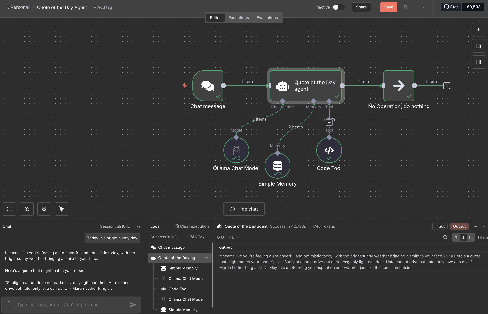

# qotd_agent
Simple agent for getting the `Quote of the Day` depending on the users' sentiments.

## Local Automation Stack Setup
This repository contains the configuration for a local-first automation environment using n8n, Ollama, and MCP.

A local setup is preferred for this project to ensure data privacy, lower latency, and zero upfront signup requirements.

### Implementation Checklist
[ ] Step 1: Start Docker Desktop/Daemon

[ ] Step 2: Provision n8n Container & Volumes

[ ] Step 3: Initialize Ollama & Pull Models

[ ] Step 4: Boot Local MCP Server

[ ] Step 5: Finalize n8n Workflow Logic

#### Setup Instructions
1. Docker Configuration
- Ensure Docker is running, then execute the following to create a persistent volume and start the n8n container. [https://docs.n8n.io/hosting/installation/docker/]

##### Create volume for persistence
```
docker volume create n8n_data
```

##### Run n8n
```
docker run -it --rm \
 --name n8n \
 -p 5678:5678 \
 -e GENERIC_TIMEZONE="UTC" \
 -e TZ="UTC" \
 -e N8N_ENFORCE_SETTINGS_FILE_PERMISSIONS=true \
 -e N8N_RUNNERS_ENABLED=true \
 -v n8n_data:/home/node/.n8n \
 docker.n8n.io/n8nio/n8n
```
[!TIP] Replace UTC with your local timezone (e.g., America/New_York) to ensure scheduled workflows trigger at the correct time.

2. Ollama & LLM
- Install Ollama and pull your preferred model.

```
ollama pull llama3
```

3. Local MCP Server
- Run your Model Context Protocol server. Ensure it is accessible by the n8n container (usually via host.docker.internal if n8n is in a container and MCP is on the host).

4. n8n Workflow
- Navigate to http://localhost:5678.
- Add an AI Agent node.
- Connect the Ollama Chat Model (pointing to http://host.docker.internal:11434).
- Link your MCP Tools.


## Sample output

